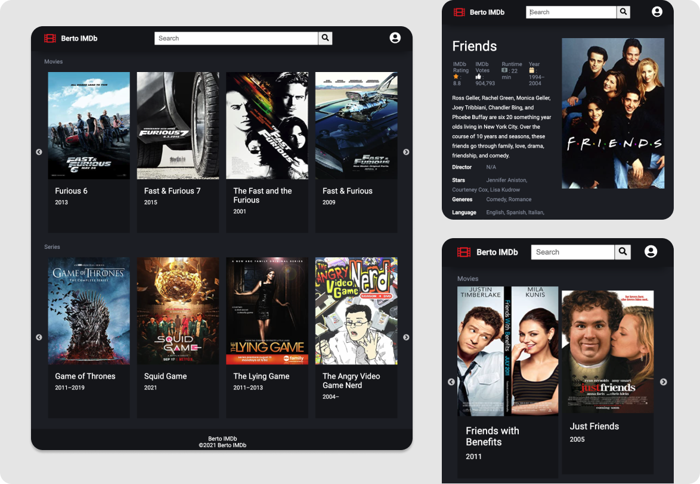

# Moive API
This is a simple but yet overcomplicated movie api website, it pulls all the movies and shows based on your search query. the API is from [OMDb API](https://www.omdbapi.com/). The website is built with React/Redux and SASS. I could have used useReducer Hook and made my life easier since it's a small project. But, I wanted to learn Redux :)

### How to run 
- Clone the repo 
- cd into it
- npm install
- npm start

